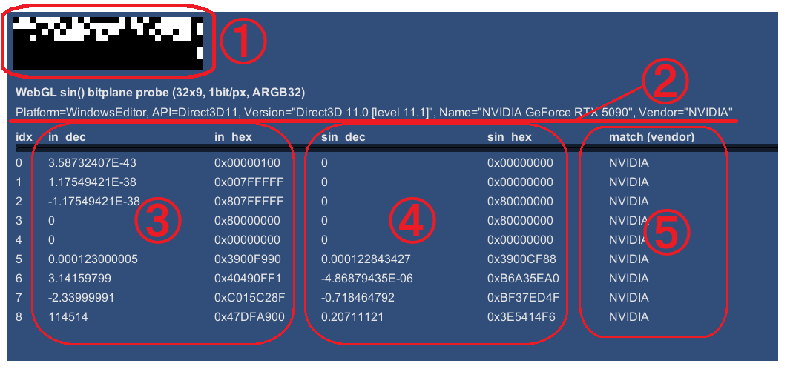
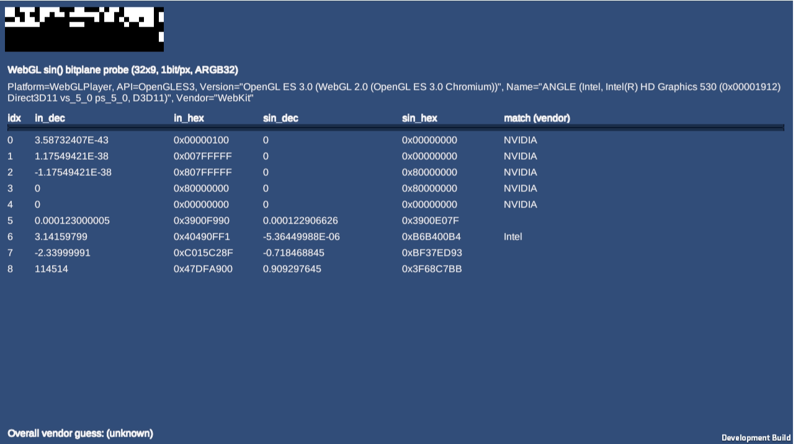
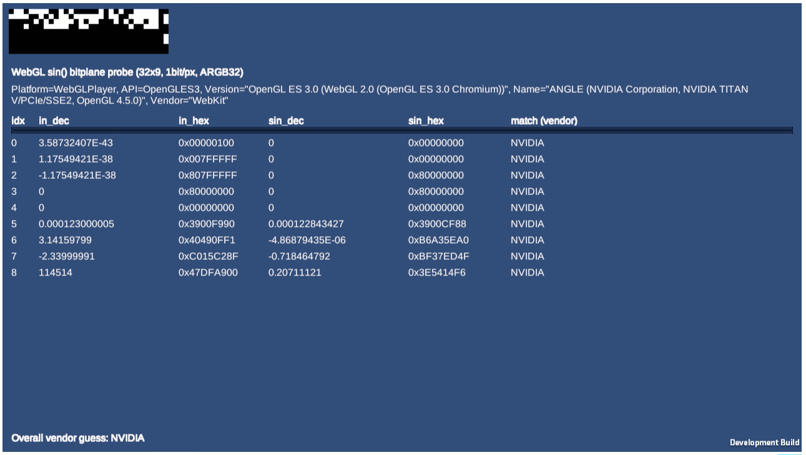
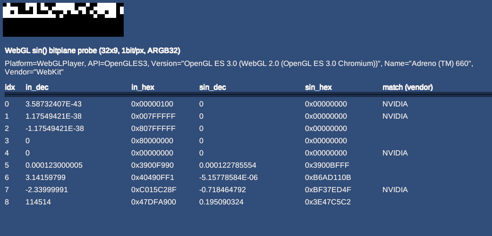

# WebGL Sin()命令誤差検証とベンダー推定
GPU上で実行する`sin()` `cos()`関数には近似版と高精度版があります。近似版はNVIDIA GPUで言うところの **SFU (Special Function Unit)** で実行されます。  
このプログラムは **近似版sin** が実行されていることを確認するためのもので、ブラウザ上で `sin(x)` を実行し、GPU 上で得られた結果を **ビット単位で読み戻し**ます。  
結果を照らし合わせることで、NVIDIA、Intel、AMDのGPUの近似版関数が使われたか、それとも高精度版が使われたか判断することができます。また本稿に正解値も載せているのでそれとどのくらい乖離があるか確認することもできます。  
参考としてGPUのsin cos命令にどの程度誤差があるのか検証した記事を書いています。補足にどうぞ。  
https://zenn.dev/toropippi/articles/d8def1c994e0a9

---

## 🔗 実行

GitHub Pages からアクセスしてブラウザで実行できます：

👉 **[Live Demo](https://toropippi.github.io/webgl-sin-sfu/)**

対応ブラウザ：Chrome / Edge / Firefox / Safari  
（WebGL 2.0 対応必須）

---

## 入力値

以下の 9 個をsin()の引数としてテストしています。

### ビットパターン (16 進 非正規化数と+-0.0)
- `0x00000100`
- `0x007FFFFF`
- `0x807FFFFF`
- `0x80000000`
- `0x00000000`

### 浮動小数 (10 進 コーナーケースとランダム)
- `0.0001230000052601099`
- `3.1415979862213135`
- `-2.3399999141693115`
- `114514.0`

## 📊 ベンダー別 SFU 出力比較

| arg_f32 | arg_hex | AMD gfx1036 (sin / hex) | Intel UHD770 (sin / hex) | NVIDIA RTX5090 (sin / hex) | 正解 (sin / hex) |
|---------|--------|------------------------|-------------------------|---------------------------|-----------------|
| 3.59E-43 | 0x00000100 | 3.62E-43 / 0x00000102 | 0 / 0x00000000 | 0 / 0x00000000 | 3.59E-43 / 0x00000100 |
| 1.18E-38 | 0x007FFFFF | 1.18E-38 / 0x007FFFFA | 0 / 0x00000000 | 0 / 0x00000000 | 1.18E-38 / 0x007FFFFF |
| -1.18E-38 | 0x807FFFFF | -1.18E-38 / 0x807FFFFA | 0 / 0x80000000 | 0 / 0x80000000 | -1.18E-38 / 0x807FFFFF |
| -0.0 | 0x80000000 | 0 / 0x80000000 | 0 / 0x80000000 | 0 / 0x80000000 | 0 / 0x80000000 |
| +0.0 | 0x00000000 | 0 / 0x00000000 | 0 / 0x00000000 | 0 / 0x00000000 | 0 / 0x00000000 |
| 0.0001230000053 | 0x3900F990 | 0.0001229999471 / 0x3900F98C | 0.0001229066111 / 0x3900E07E | 0.0001228434267 / 0x3900CF88 | 0.0001230000053 / 0x3900F990 |
| 3.141597986 | 0x40490FF1 | -5.24E-06 / 0xB6AFEDE4 | -5.36E-06 / 0xB6B400B4 | -4.87E-06 / 0xB6A35EA0 | -5.33E-06 / 0xB6B2EEF5 |
| -2.339999914 | 0xC015C28F | -0.7184648514 / 0xBF37ED50 | -0.7184648514 / 0xBF37ED50 | -0.7184647918 / 0xBF37ED4F | -0.7184648514 / 0xBF37ED50 |
| 114514 | 0x47DFA900 | 0.1950903386 / 0x3E47C5C3 | 0.9092974067 / 0x3F68C7B7 | 0.2071112096 / 0x3E5414F6 | 0.1926048398 / 0x3E453A34 |

## 🖼 出力画面の見方

- **①9引数に対応する結果のbit表現**
  - 32x9 のビットプレーンとして GPU → CPU にデータを戻しています。  
  - 1bit/px なので、どの環境でもビット完全一致が保証されます。  
  - ただし計算結果はGPUのベンダーによって少しずつ異なるようです。  

- **②環境情報**  
  - Unity の `SystemInfo.graphicsDeviceType` や `graphicsDeviceVersion` などを表示  
  - 例：`API=OpenGLES3, Name=ANGLE (NVIDIA GeForce RTX 5090), Vendor="WebKit"`  
  - これらはプログラムから取得できる情報  

- **テーブル列の意味③④⑤**
  | 列名        | 説明 |
  |-------------|------|
  | **idx**     | 入力のインデックス番号（0〜8） |
  | **in_dec**  | 入力値（10進） |
  | **in_hex**  | 入力値の 32bit ビットパターン |
  | **sin_dec** | GLSL `sin(x)` の結果（10進） |
  | **sin_hex** | その結果を 32bit として再解釈したビット列 |
  | **match (vendor)** | 既知の参照テーブルと **ビット完全一致**したベンダー名（NVIDIA/AMD/Intel） |

- **Overall vendor guess**  
  9 個の入力のすべてで同じベンダーと一致した場合に、そのベンダー名をまとめて表示します。

---

## ⚙ 実装ポイント

- **1bit/px エンコード**  
  GLSL シェーダーで `sin(x)` の結果を `asuint()` し、各ビットを 32px 横一列に出力。  
  CPU 側はピクセルを走査して 32bit 値を復元するため、浮動小数の丸めや UNorm 誤差の影響を受けません。

- **参照テーブル**  
  主要3ベンダー（AMD gfx1036, Intel UHD770, NVIDIA RTX5090）の既知結果を格納。  
  ビット完全一致ならベンダー名を表示します。

## 結果の解釈
**match (vendor)** に注目してください。  
- **"NVIDIA","AMD" "Intel"** : 全部一致していればそのGPUのSFUでsin()が実行されたことになります。つまり **近似版** が使われています。
- **何も表示されてない** : このプログラムに内蔵されている既知の結果に合致していないので、近似版が使われたのか高精度版が使われたのかすぐにはわかりません。  
  - そこで "ベンダー別 SFU 出力比較" の項の正解値と見比べて、9パターン全て **2 ULP以内** の誤差であれば高精度版が使われた可能性が高い、と判断できます。  
  - そうでない場合、つまり2 ULPを超える誤差が明らかにある場合、近似版sinの計算が行われたと判断できます。  

ちなみにプログラムに埋め込まれている既知の結果は  
AMD gfx1036, Intel UHD770, NVIDIA RTX5090のものです。アーキテクチャの違いにより結果が異なることが想定されるので、何も表示されなかったからといって必ずしも高精度版ではないことに注意してください。  

### Intel Graphics HD 530の場合  

  
このように同じIntelでもIntel UHD770と一致しないことがあります。  

### TITAN Vの場合　　
  

NVIDIA GPUはアーキテクチャが異なっても完全一致する可能性が高そうです。  

### Adreno 660の場合

  
idx=7の`-2.339999914`でNVIDIAに一致していますが、この値はもともと近似版sinでも**0 ULP** に近いほど高精度な結果を返す引数です。  
一方idx=8の`114514`に着目すると AMD gfx1036 の結果にかなり近いことがわかります。  
idx=6の`3.14159799`を見ると `-5.36E-06`という値が出力されていますが、正解は`-5.33E-06` なので有効桁数が2桁程度しかないことがわかります。スマホGPUでも高精度版ではなく近似版が実行されているのでしょう。  

### なぜ WebGL では近似版が使われるのか
WebGL / GLSL ES の `sin()` は、**高精度な数学ライブラリ呼び出しではなく、GPU のネイティブ組み込み関数（intrinsic）にマッピングされる仕様**になっています。  
Unity では HLSL の `sin()` → GLSL ES の `sin()` にクロスコンパイルされ、その後ブラウザ実装（ANGLE など）が各 OS / GPU 向けにシェーダを再コンパイルします。  

その結果多くの GPU ドライバは `sin()` を **SFU (Special Function Unit)** 命令に変換します。SFU は高速ですが、  
- 引数を内部で範囲縮約（mod 2π）するときに係数が短精度化される  
- 多項式近似（例えば Chebyshev 展開）で1サイクルで結果を出す  
といった実装になっており、IEEE754 完全準拠よりも速度優先です。  

結果として WebGL で実行した `sin()` は、ほぼ確実に「近似版（高速版）」の結果になります。  
ブラウザ側で高精度版に差し替える選択肢はなく、精度が必要な場合は  
- CPU 側で計算する  
- あるいは GLSL で高精度展開を自前実装する  
必要があります。

---

## 📜 ライセンス

MIT ライセンス